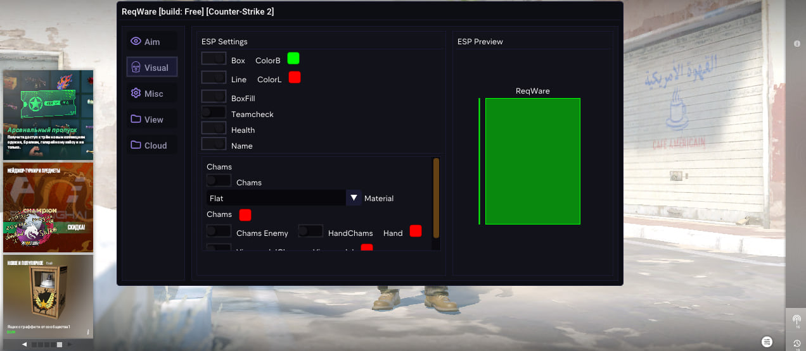

---
### ReqWare - This is Internal Cheat CS2, Injection of all games made in C++ 
---

### How to run ReqWare
Build DLL:
-
1. **Open the project in Visual Studio.
Set the build configuration to Release x64.
Build the solution (Build > Build Solution).**

2. **Find reqware.dll in the \Release\x64\ folder.
Use a DLL injector "Extreme Injector" to inject reqware.dll into the game cs2.exe.
To make the DLL work**

3. **Launch Counter-Strike 2 and start using ReqWare
Bind menu "Insert"**

**Subcribe my telegram channel cs2 -> https://t.me/reqwarecs2**
**Subcribe my main telegram channel -> @perehodhellpc**
-
## Screen

| Description | Image |
|-------------|-------|
| **Menu**     |  |
